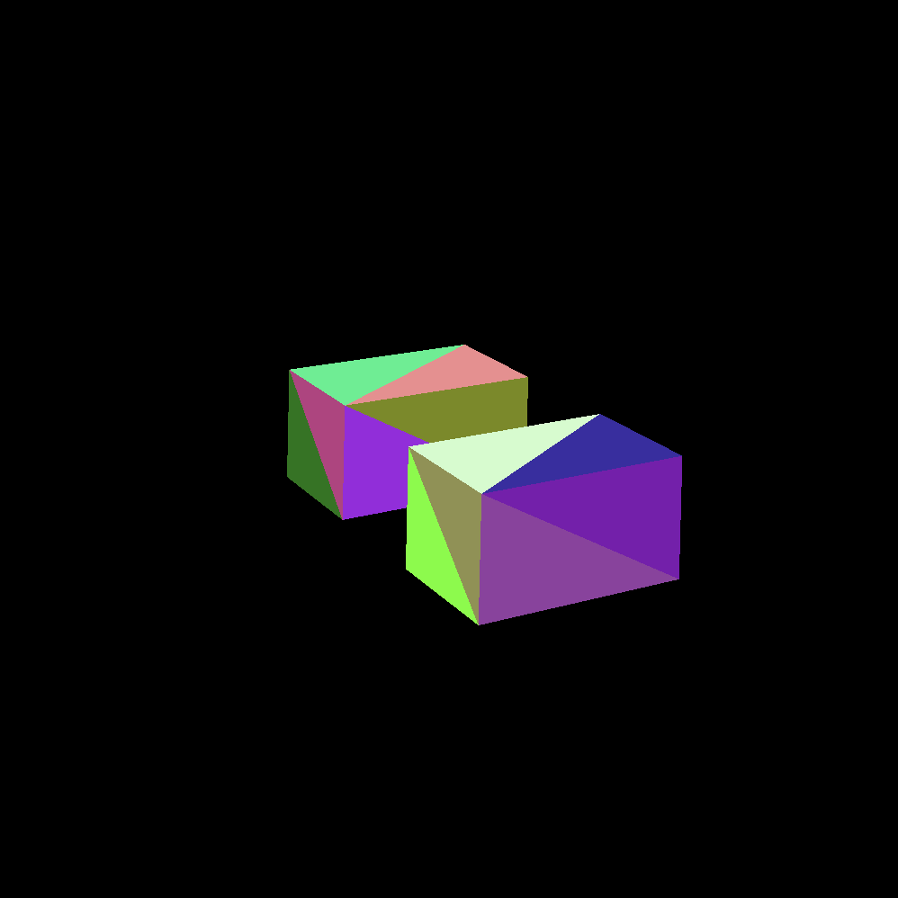

# This is what I did
1. Created a basic 3D model
2. Encoded the model into Image object. Each pixel is a 3D point
3. Implemented raytracing code into fragment shader
4. Passed the 3D model (sampler2D) and a camera information (floats) into the fragment shader

This implementation has a lot of limitation (performance, flexibility, etc) but it's 3D rendering in Flutter :)

You can read more about flutter fragment shaders here (https://docs.flutter.dev/ui/design/graphics/fragment-shaders)